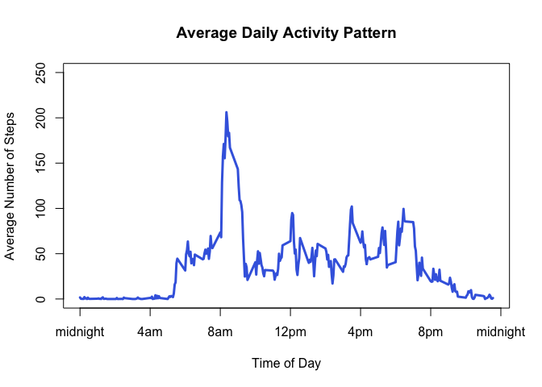

# Reproducible Research: Peer Assessment 1
Yazad Jal  

## Loading and preprocessing the data

We first download the zipfile from the web and save it in the working directory


```r
fileurl <- "https://d396qusza40orc.cloudfront.net/repdata%2Fdata%2Factivity.zip"
destfile <- paste0(getwd(),"/","activity.zip")
download.file(fileurl, destfile, method = "curl", quiet = TRUE)
```

Then we unzip the downloaded file and get a feel for the data using str


```r
unzip("activity.zip")
activity <- read.csv("activity.csv")
str(activity)
```

```
## 'data.frame':	17568 obs. of  3 variables:
##  $ steps   : int  NA NA NA NA NA NA NA NA NA NA ...
##  $ date    : Factor w/ 61 levels "2012-10-01","2012-10-02",..: 1 1 1 1 1 1 1 1 1 1 ...
##  $ interval: int  0 5 10 15 20 25 30 35 40 45 ...
```

To calculate total number steps per day, I created a new data frame called totalsteps and then made a histogram. 


```r
totalsteps<-aggregate(steps~date,data=activity,sum,na.rm=TRUE)
hist(totalsteps$steps, 
        col = "royalblue", border = "royalblue", density = 50,
        xlab = "Number of Steps", main = "Total steps per day",
        ylim = c(0,30))
```

<!-- -->

## What is mean total number of steps taken per day?

Calculating the mean and median of the total number of steps taken per day:


```r
mn <- mean(totalsteps$steps)
md <- median(totalsteps$steps)
```


The mean total number of steps per day is 10766.19 and the median is 10765


## What is the average daily activity pattern?

First I created a new data frame, fivemin, which aggregates the activity on each five minute interval across the 61 days, and then plot it, giving us the average daily activity pattern.


```r
fivemin <- aggregate(steps~interval, data = activity, mean, na.rm=TRUE)
plot(fivemin$interval, fivemin$steps, type = "l", col = "royalblue", lwd=2,
     xlab="Hour of Day", ylab="Number of Steps", 
     main="Average Daily Activity Pattern")
```

<!-- -->

Computing the five minute interval with the maximum number of steps

```r
max <- fivemin[which.max(fivemin$steps),]$interval
max2 <-paste0(0, max)
max3 <-paste0(0, (max+5))
```

From 0835 to 0840 is when the maximum exercise happens.

## Imputing missing values


## Are there differences in activity patterns between weekdays and weekends?
