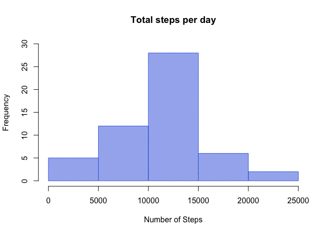

# Reproducible Research: Peer Assessment 1
Yazad Jal  

## Loading and preprocessing the data

We first download the zipfile from the web and save it in the working directory


```r
fileurl <- "https://d396qusza40orc.cloudfront.net/repdata%2Fdata%2Factivity.zip"
destfile <- paste0(getwd(),"/","activity.zip")
download.file(fileurl, destfile, method = "curl", quiet = TRUE)
```

Then we unzip the downloaded file and get a feel for the data using str


```r
unzip("activity.zip")
activity <- read.csv("activity.csv")
str(activity)
```

```
## 'data.frame':	17568 obs. of  3 variables:
##  $ steps   : int  NA NA NA NA NA NA NA NA NA NA ...
##  $ date    : Factor w/ 61 levels "2012-10-01","2012-10-02",..: 1 1 1 1 1 1 1 1 1 1 ...
##  $ interval: int  0 5 10 15 20 25 30 35 40 45 ...
```

To calculate total number steps per day, I created a new data frame called totalsteps and then made a histogram. 


```r
totalsteps<-aggregate(steps~date,data=activity,sum,na.rm=TRUE)
hist(totalsteps$steps, 
        col = "royalblue", border = "royalblue", density = 50,
        xlab = "Number of Steps", main = "Total steps per day",
        ylim = c(0,30))
```

<!-- -->

## What is mean total number of steps taken per day?

Calculating the mean and median of the total number of steps taken per day:


```r
mn <- mean(totalsteps$steps)
md <- median(totalsteps$steps)
```


The mean total number of steps per day is 10766.19 and the median is 10765


## What is the average daily activity pattern?

First I created a new data frame, fivemin, which aggregates the activity on each five minute interval across the 61 days, and then plot it, giving us the average daily activity pattern.


```r
fivemin <- aggregate(steps~interval, data = activity, mean, na.rm=TRUE)
plot(fivemin$interval, fivemin$steps, type = "l", col = "royalblue", lwd=3,
     xlab="Time of Day", ylab="Average Number of Steps", 
     main="Average Daily Activity Pattern", xaxt="n")
axis(side=1, at = c(0, 400, 800, 1200, 1600, 2000, 2400), 
     labels = c("midnight", "4am", "8am", "12pm", "4pm", "8pm", "midnight"))
abline(v=835, col="yellowgreen", lty=3, lwd=2)
```

<!-- -->

Computing the five minute interval with the maximum number of steps

```r
max <- fivemin[which.max(fivemin$steps),]$interval
max2 <-paste0(0, max)
max3 <-paste0(0, (max+5))
```

From 0835 to 0840 is when the maximum exercise happens.

## Imputing missing values

Calculating and reporting the total number of missing values in the dataset (i.e. the total number of rows with NAs): 

```r
isna <- sum(is.na(activity$steps))
```

There are 2304 rows with missing values in the dataset

I've used two strategies to fill in the missing values. The first is using the impute function from the Hmisc package, and creating a new dataset, totalsteps2, and a new histogram. 


```r
library(Hmisc, quietly = TRUE)
activityImputed <- activity
activityImputed$steps <- impute(activity$steps, fun=mean)
totalsteps2<-aggregate(steps~date,data=activityImputed,sum,na.rm=TRUE)
```


```r
hist(totalsteps2$steps, 
        col = "red", border = "red", density = 50,
        xlab = "Number of Steps", main = "Total steps per day",
        ylim = c(0,35))
```

<!-- -->

The new mean and median using this method are:

```r
mean(totalsteps2$steps)
```

```
## [1] 10766.19
```

```r
median(totalsteps2$steps)
```

```
## [1] 10766.19
```

The mean has statyed the same (it should, as the method imputed the mean and replaced the NA values with it). The median has changed and is now equal to the mean. 

Comparing the histograms:

```r
par(mfrow=c(1,2))
hist(totalsteps$steps, 
        col = "royalblue", border = "royalblue", density = 50,
        xlab = "Number of Steps", main = "Total steps per day (original)",
        ylim = c(0,35))

hist(totalsteps2$steps, 
        col = "red", border = "red", density = 50,
        xlab = "Number of Steps", main = "Total steps per day (new)",
        ylim = c(0,35))
```

<!-- -->

```r
par(mfrow=c(1,1))
```

The impact of imputing missing data seems to be to increase the average frequency. 


The second method used is k nearest neighbors from the VIM package.


```r
library(VIM)
act <- activity
knnact <- kNN(act)
totalsteps3<-aggregate(steps~date,data=knnact,sum,na.rm=TRUE)
```

The new mean and median using this method are:

```r
mean(totalsteps3$steps)
```

```
## [1] 9752.393
```

```r
median(totalsteps3$steps)
```

```
## [1] 10395
```

The mean and median have both decreased. That is because the method has imputed 0 values for many of the NA values.


```r
hist(totalsteps2$steps, 
        col = "seagreen3", border = "seagreen3", density = 50,
        xlab = "Number of Steps", main = "Total steps per day",
        ylim = c(0,35))
```

<!-- -->

Comparing both methods with the original histogram

```r
par(mfrow=c(1,3))
hist(totalsteps$steps, 
        col = "royalblue", border = "royalblue", density = 50,
        xlab = "Number of Steps", main = "Total steps per day (original)",
        ylim = c(0,40))

hist(totalsteps2$steps, 
        col = "red", border = "red", density = 50,
        xlab = "Number of Steps", main = "Total steps per day (hmisc)",
        ylim = c(0,40))

hist(totalsteps2$steps, 
        col = "seagreen3", border = "seagreen3", density = 50,
        xlab = "Number of Steps", main = "Total steps per day (knn)",
        ylim = c(0,40))
```

<!-- -->

```r
par(mfrow=c(1,1))
```


Make a histogram of the total number of steps taken each day and Calculate and report the mean and median total number of steps taken per day. Do these values differ from the estimates from the first part of the assignment? What is the impact of imputing missing data on the estimates of the total daily number of steps?

## Are there differences in activity patterns between weekdays and weekends?
